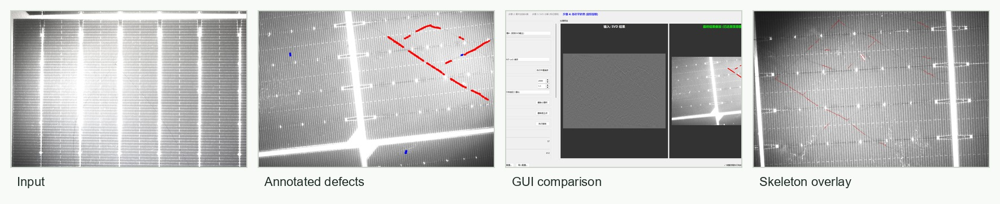
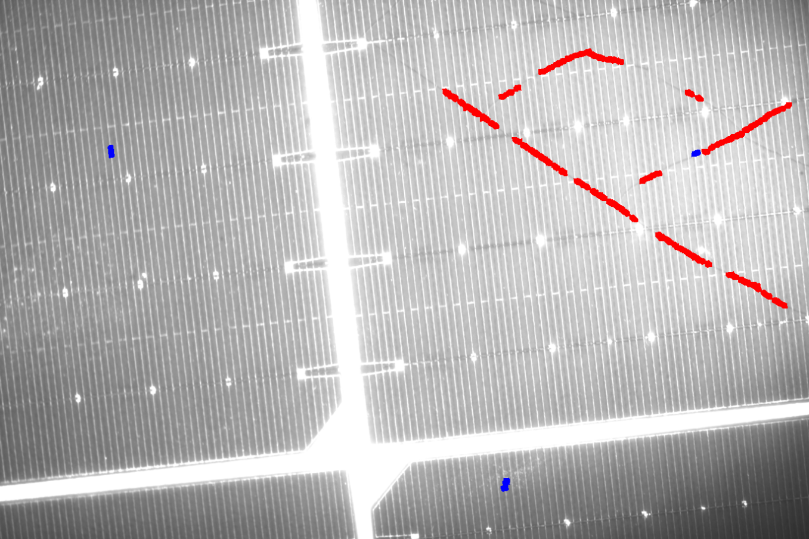
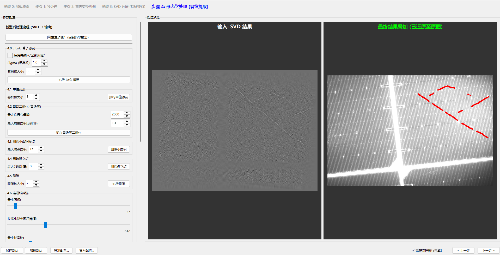
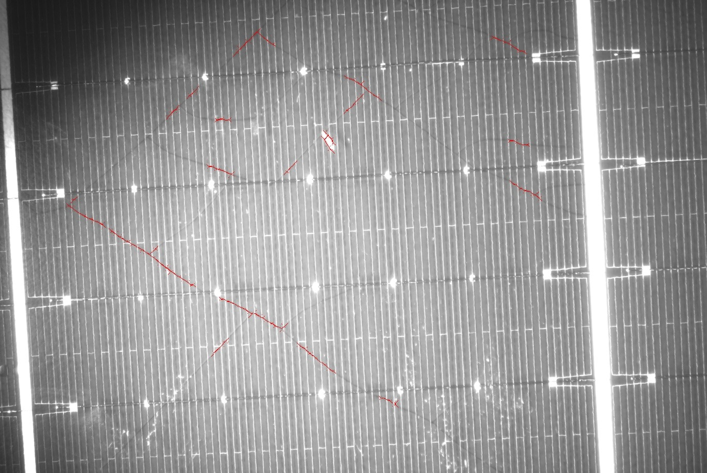
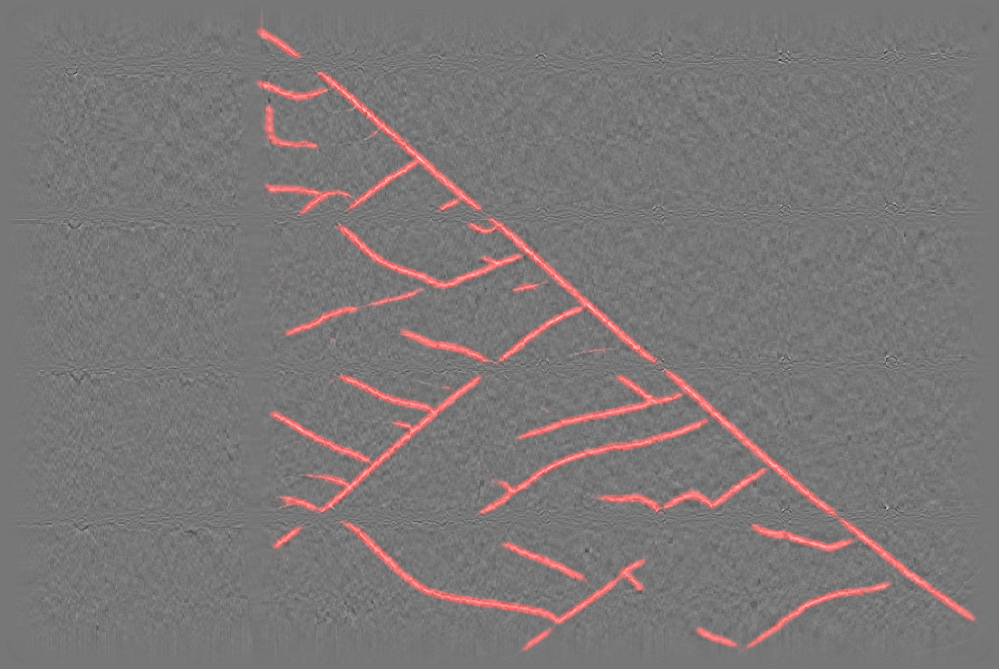

# Solar Cell Panel Crack Detection

## Overview

This project explores machine-vision methods for detecting internal crack-like defects in solar cell panel images. The main pipeline combines illumination/background correction, grid rectification, SVD-based reconstruction, thresholding, morphology, connected-component filtering, and skeleton/overlay visualization. A secondary segmentation workflow uses manually annotated SVD images to train a lightweight UNet model for pixel-level crack highlighting. The repository has been reorganized for academic portfolio review, with core code, configuration files, representative figures, and project documentation separated from local data and large training artifacts.

## My Role

- Built and integrated the image-processing workflow for defect enhancement, including background normalization, Hough-based grid rectification, SVD reconstruction, binary segmentation, morphology, and connected-component filtering.
- Developed an interactive Tkinter GUI for parameter tuning, step-by-step visualization, result export, and single-image inspection.
- Added batch-processing utilities for folder-level inference and HTML result review.
- Prepared the UNet segmentation submodule, including dataset preparation, annotation GUI, mask checking, model training, and overlay inference scripts.
- Wrote and organized the experiment notes, final report materials, configuration presets, and representative result visualizations.

## Features

- Interactive GUI for loading solar cell images and inspecting each processing stage.
- Traditional vision pipeline with configurable preprocessing, SVD reconstruction, thresholding, morphology, and defect candidate filtering.
- Batch processor for applying the configured pipeline to image folders.
- Lightweight HTML report generator for batch output review.
- UNet-based segmentation workflow for SVD images, with annotation, training, validation, and overlay inference scripts.
- Public-facing documentation that separates code, representative assets, local data notes, and model-weight notes.

## Tech Stack

- Python
- OpenCV
- NumPy
- Pillow
- Tkinter
- PyTorch / TorchVision
- tqdm
- SVD-based image reconstruction
- Hough transform, morphology, connected-component analysis
- UNet semantic segmentation

## Repository Structure

```text
crack-detection/
├── README.md
├── .gitignore
├── LICENSE
├── requirements.txt
├── src/
│   ├── integrated_crack_detector_gui.py
│   ├── batch_crack_processor_gui.py
│   ├── batch_svd_processor.py
│   ├── generate_batch_report.py
│   └── svd_seg/
├── configs/
├── docs/
├── assets/
├── results/
├── data/
│   └── README.md
├── models/
│   └── README.md
├── notebooks/
└── archive_local/
```

## Installation

Create a Python environment and install the dependencies:

```powershell
python -m venv .venv
.\.venv\Scripts\Activate.ps1
pip install -r requirements.txt
```

If PyTorch installation needs a CUDA-specific build, install it according to the official PyTorch selector first, then install the remaining dependencies from `requirements.txt`.

## Usage

Run the interactive crack detection GUI:

```powershell
python src\integrated_crack_detector_gui.py
```

Run batch SVD preprocessing on a folder of images:

```powershell
python src\batch_svd_processor.py path\to\images --output results_svd --config configs\crack_detection_config.json
```

Run the batch crack detection GUI:

```powershell
python src\batch_crack_processor_gui.py
```

Train the UNet segmentation workflow after preparing a local dataset:

```powershell
python src\svd_seg\prepare_split_seg.py --src path\to\Trainset --out data\seg_dataset --train 0.8
python src\svd_seg\annotate_seg_gui.py --root data\seg_dataset --subset train
python src\svd_seg\train_unet.py --data data\seg_dataset --epochs 50 --img 512 --batch 8
python src\svd_seg\infer_overlay.py --data data\seg_dataset --weights models\best.pt --subset val
```

## Results

Representative outputs are kept in `assets/` and `results/` for quick review.

The parallel overview below summarizes the main inspection flow: raw solar-cell imagery, manually marked defect regions, GUI-side intermediate comparison, and final skeleton-style overlay visualization.



Selected supporting visuals:









The full local workspace also contains batch outputs, SVD result folders, training overlays, and model checkpoints. These artifacts are excluded from the public repository by `.gitignore` because of file size and data-authorization considerations.

## Data and Model Notes

The full original image data, generated datasets, batch results, training logs, model checkpoints, and zipped training archives are not intended for direct GitHub upload. See `data/README.md` and `models/README.md` for the current public-data and model-weight policy.

The original final PDF report is kept locally and ignored because its filename contains a name and student ID. Public release should use a renamed or redacted copy after confirming school/course submission requirements and personal-information exposure.

## Limitations

- Full reproducibility depends on access to the original solar cell panel image dataset.
- Some GUI text in legacy scripts may display garbled Chinese if opened with the wrong encoding or terminal locale.
- The UNet weights are not included in the public repository, so segmentation inference requires retraining or separately obtaining local weights.
- The project has been organized for portfolio review; additional tests, packaging, and command-line polish would be useful before presenting it as a production tool.

## License

This repository is currently prepared for academic portfolio demonstration. A formal open-source license is pending confirmation of data ownership, third-party materials, and collaboration constraints. See `LICENSE` for the current restricted-use notice.

